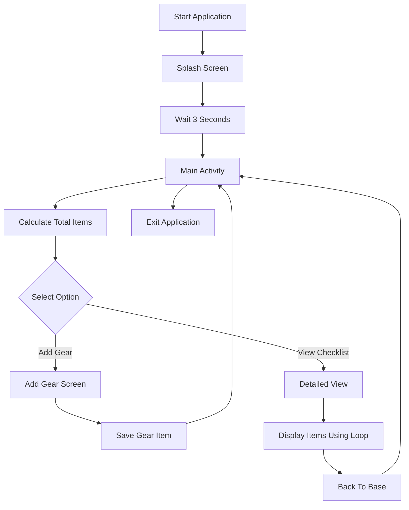

# Campsite Commander 

## Overview

Campsite Commander is an Android mobile application developed using Kotlin in Android Studio.

The application helps campers organize and manage camping equipment before a trip by allowing users to:

- Add camping gear
- Categorize equipment
- Record quantities
- Add comments and notes
- View a complete camping checklist
- Calculate the total number of packed items

---

## Features

 Splash Screen

 Add Gear Functionality

 View Checklist Functionality

 Parallel Arrays

 Loops and Functions

 Total Items Packed Calculation

 Activity Navigation

 Input Validation

Dark Camping Theme

---

## Technologies Used

- Kotlin
- Android Studio
- XML
- GitHub

---

## Application Screenshots

### Splash Screen


### Main Screen


### Add Gear Screen


### Detailed View Screen


---

## Flowchart



---

## Pseudocode

```text
START

Display Splash Screen

Wait 3 seconds

Open Main Activity

Calculate Total Items

FOR each quantity
    Add quantity to total
NEXT

IF Add Gear selected
    Save item details
ENDIF

IF View Checklist selected
    Display checklist
ENDIF

END
```

---

## Installation

1. Download the project.
2. Open Android Studio.
3. Select Open Project.
4. Run the application using an emulator or Android device.

---


## Author

Name: MULENGA NOAM 

Student Number: ST10517736

Module: IMAD

---

## References

Android Developers (2025). Android Developers Documentation. Available at: https://developer.android.com

JetBrains (2025). Kotlin Documentation. Available at: https://kotlinlang.org/docs/home.html

GitHub (2025). GitHub Documentation. Available at: https://docs.github.com
